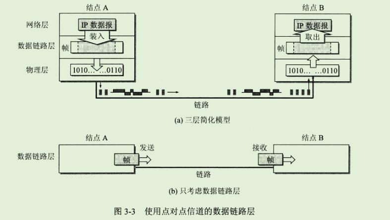
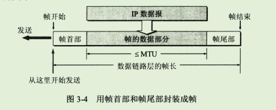
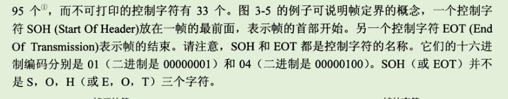
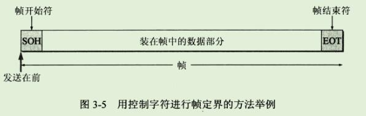

第三章 数据链路层

```
数据链路层属于计算机网络的低层。数据链路层使用的信道主要有以下两种类型：

1、点对点信道。这种信道使用一对一的点对点通信方式。

2、广播信道。这种信道使用一对多的广播通信方式，因此过程比较复杂。
广播信道上连接的主机很多，因此必须使用专用的共享信道协议来协调这些主机的数据发送。 
```

```
局域网虽然是个网络，但我们并不把局域网放在网络中讨论。
这是因为在网络层要讨论的问题是分组怎么样从一个网络通过路由器转发到另一个网络，
但在本章中我们研究的是在同一个局域网中，分组怎样从一个主机传送到另一个主机(不经过路由器)。
因此，这是属于数据链路层的范围。
```

```
本章的大致内容是：
	1、数据链路层的点对点信道和广播信道的特点，以及这两种信道所使用的协议(PPP 协议以及 CSMA/CD协议)的特点。
	2、数据链路层的三个基本问题：封装成帧、透明传输和差错检测。
	3、适配器、转发器、集线器、网桥、以太网交换机的作用以及使用场合。
```


## 1、使用点对点信道的数据链路层

### 1、数据链路和帧

```
我们在这里要明确一下，"链路"和"数据链路"并不是一回事。
```

```
所谓链路"link"就是从一个结点到相邻结点的一段物理线路(有线或无线)，而中间没有任何其他的交换结点。
在进行数据通信时，两个计算机之间的通信路径往往要经过许多段这样的链路。
可见链路只是一条路径的组成部分。
```

```
数据链路(data link)则是另一个概念。
这是因为当需要在一条线上传送数据时，除了必须有一条物理线路外，还必须有一些必要的通信协议来控制这些数据的传输。
若把实现这些协议的硬件和软件加到链路上，就构成了数据链路。
现在最常用的方法是使用 网络适配器(既有硬件，也包括软件)来实现这些协议。
一般的适配器都包括了数据链路层和物理层这两层的功能。
```

```
也有人采用另外的术语。
这就是把链路分为物理链路和逻辑链路。
物理链路就是上面所说的链路，而逻辑链路就是上面的数据链路，是物理链路加上必要的通信协议。
```

```
早期的数据通信协议曾叫作通信规程(procedure)。
因此在数据链路层，规程和协议是同义词。
```

```
下面再介绍点对点信道的数据链路层的协议数据单元 --- 帧。
```

```
数据链路层把网络层交下来的数据构成帧发送到链路上，以及把接收到的帧中的数据取出并上交给网络层。
在因特网中，网络层协议数据单元就是IP数据报(或简称为数据报、分组或包)。
```

```
为了把主要精力放在点对点信道的数据链路层协议上，可以采用如图 3-3(a)所示的三层模型。
```



```
点对点信道的数据链路层在进行通信时的主要步骤如下：
1、结点A的数据链路层把网络层交下来的IP数据报添加首部和尾部封装成帧。
2、结点A把封装好的帧发送给结点B的数据链路层。
3、若结点B的数据链路层收到的帧无差错，则从收到的帧中提取出IP数据报上交给上面的网络层；否则丢弃这个帧。

数据链路层不必考虑物理层如何实现比特传输的细节。
我们甚至还可以更简单的设想好像是沿着两个数据链路层之间的水平方向把帧直接发送给对方，如图3-3(b)所示。
```

### 2、三个基本问题

```
数据链路层协议有许多种，但有三个基本问题则是共同的。
这三个基本问题是：封装成帧、透明传输和差错检测。
下面分别讨论这三个基本问题。
```

#### 1、封装成帧

```
封装成帧(framing)就是在一段数据的前后分别添加首部和尾部，这样就构成了一个帧。
接收端再收到物理层上交的比特流后，就能根据首部和尾部的标记，从收到的比特流中识别帧的开始和结束。

图3-4表示用帧首部和帧尾部封装成帧的一般概念。
我们知道，分组交换的一个重要的概念就是：
所有因特网上传送的数据都是以分组(即IP数据报)为传送单位的。

网络层的ip数据报传送到数据链路层就成为帧的数据部分。
在帧的数据部分的前面和后面分别添加上首部和尾部，构成了一个完整的帧。
这样的帧就是数据链路层的数据传送单元。

一个帧的帧长等于帧的数据部分长度加上帧首部和帧尾部的长度。
首部和尾部的一个重要作用就是进行帧定界(即确定帧的界限)。
此外，首部和尾部还包括许多必要的控制信息。
在发送帧时，是从帧首部开始发送。
各种数据链路层协议都对帧首部和帧尾部的格式有明确的规定。
显然，为了提高帧的传输效率，应当使帧的数据部分长度尽可能的大于首部和尾部的长度。

但是，每一种链路层协议都规定了所能传送的帧的数据部分长度上限 --- 最大传送单元 MTU(Maximum Transfer Unit)。
图3-4给出了帧的首部和尾部的位置，以及帧的数据部分与MTU的关系。
```



```
当数据是由可打印的 ASCII 码组成的文本文件时，帧定界可以使用特殊的帧定界符。
我们知道，ASCII 码是7位编码，一共可组成128个不同的 ASCII 码，其中可打印的有95个，而不可打印的控制字符有33个。
```





```
当
```


