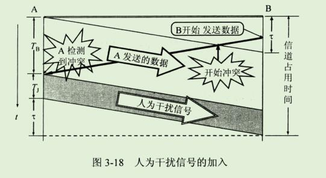
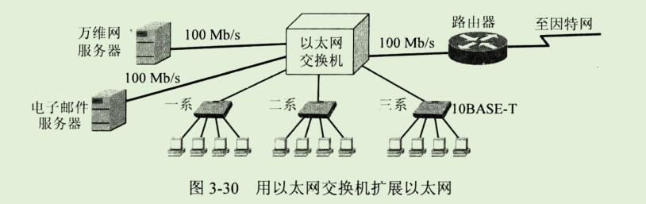

第三章 数据链路层


```
数据链路层协议几乎总是把 CRC 放在尾部，而不是放在头部，为什么

答案：
	CRC是在发送期间进行计算的。
	一旦把最后一位数据送上外出线路，就立即把CRC编码附加在输出流的后面发出。
	如果CRC放在帧的头部，那么就要在发送之前把整个帧先检查一遍来计算CRC。
	这样每个字节都要处理两遍，第一遍是为了计算检验码，第二遍是为了发送。
	把CRC放在尾部就可以把处理时间减半。
```


```
数据链路层属于计算机网络的低层。数据链路层使用的信道主要有以下两种类型：

1、点对点信道。这种信道使用一对一的点对点通信方式。

2、广播信道。这种信道使用一对多的广播通信方式，因此过程比较复杂。
广播信道上连接的主机很多，因此必须使用专用的共享信道协议来协调这些主机的数据发送。 
```

```
局域网虽然是个网络，但我们并不把局域网放在网络中讨论。
这是因为在网络层要讨论的问题是分组怎么样从一个网络通过路由器转发到另一个网络，
但在本章中我们研究的是在同一个局域网中，分组怎样从一个主机传送到另一个主机(不经过路由器)。
因此，这是属于数据链路层的范围。
```

```
本章的大致内容是：
	1、数据链路层的点对点信道和广播信道的特点，以及这两种信道所使用的协议(PPP 协议以及 CSMA/CD协议)的特点。
	2、数据链路层的三个基本问题：封装成帧、透明传输和差错检测。
	3、适配器、转发器、集线器、网桥、以太网交换机的作用以及使用场合。
```


## 1、使用点对点信道的数据链路层

### 1、数据链路和帧

```
我们在这里要明确一下，"链路"和"数据链路"并不是一回事。
```

```
所谓链路"link"就是从一个结点到相邻结点的一段物理线路(有线或无线)，而中间没有任何其他的交换结点。
在进行数据通信时，两个计算机之间的通信路径往往要经过许多段这样的链路。
可见链路只是一条路径的组成部分。
```

```
数据链路(data link)则是另一个概念。
这是因为当需要在一条线上传送数据时，除了必须有一条物理线路外，还必须有一些必要的通信协议来控制这些数据的传输。
若把实现这些协议的硬件和软件加到链路上，就构成了数据链路。
现在最常用的方法是使用 网络适配器(既有硬件，也包括软件)来实现这些协议。
一般的适配器都包括了数据链路层和物理层这两层的功能。
```

```
也有人采用另外的术语。
这就是把链路分为物理链路和逻辑链路。
物理链路就是上面所说的链路，而逻辑链路就是上面的数据链路，是物理链路加上必要的通信协议。
```

```
早期的数据通信协议曾叫作通信规程(procedure)。
因此在数据链路层，规程和协议是同义词。
```

```
下面再介绍点对点信道的数据链路层的协议数据单元 --- 帧。
```

```
数据链路层把网络层交下来的数据构成帧发送到链路上，以及把接收到的帧中的数据取出并上交给网络层。
在因特网中，网络层协议数据单元就是IP数据报(或简称为数据报、分组或包)。
```

```
为了把主要精力放在点对点信道的数据链路层协议上，可以采用如图 3-3(a)所示的三层模型。
```


```
点对点信道的数据链路层在进行通信时的主要步骤如下：
1、结点A的数据链路层把网络层交下来的IP数据报添加首部和尾部封装成帧。
2、结点A把封装好的帧发送给结点B的数据链路层。
3、若结点B的数据链路层收到的帧无差错，则从收到的帧中提取出IP数据报上交给上面的网络层；否则丢弃这个帧。

数据链路层不必考虑物理层如何实现比特传输的细节。
我们甚至还可以更简单的设想好像是沿着两个数据链路层之间的水平方向把帧直接发送给对方，如图3-3(b)所示。
```

### 2、三个基本问题

```
数据链路层协议有许多种，但有三个基本问题则是共同的。
这三个基本问题是：封装成帧、透明传输和差错检测。
下面分别讨论这三个基本问题。
```

#### 1、封装成帧

```
封装成帧(framing)就是在一段数据的前后分别添加首部和尾部，这样就构成了一个帧。
接收端再收到物理层上交的比特流后，就能根据首部和尾部的标记，从收到的比特流中识别帧的开始和结束。

图3-4表示用帧首部和帧尾部封装成帧的一般概念。
我们知道，分组交换的一个重要的概念就是：
所有因特网上传送的数据都是以分组(即IP数据报)为传送单位的。

网络层的ip数据报传送到数据链路层就成为帧的数据部分。
在帧的数据部分的前面和后面分别添加上首部和尾部，构成了一个完整的帧。
这样的帧就是数据链路层的数据传送单元。

一个帧的帧长等于帧的数据部分长度加上帧首部和帧尾部的长度。
首部和尾部的一个重要作用就是进行帧定界(即确定帧的界限)。
此外，首部和尾部还包括许多必要的控制信息。
在发送帧时，是从帧首部开始发送。
各种数据链路层协议都对帧首部和帧尾部的格式有明确的规定。
显然，为了提高帧的传输效率，应当使帧的数据部分长度尽可能的大于首部和尾部的长度。

但是，每一种链路层协议都规定了所能传送的帧的数据部分长度上限 --- 最大传送单元 MTU(Maximum Transfer Unit)。
图3-4给出了帧的首部和尾部的位置，以及帧的数据部分与MTU的关系。
```


```
当数据是由可打印的 ASCII 码组成的文本文件时，帧定界可以使用特殊的帧定界符。
我们知道，ASCII 码是7位编码，一共可组成128个不同的 ASCII 码，其中可打印的有95个，而不可打印的控制字符有33个。
```


```
当数据在传输中出现差错时，帧定界符的作用更加明显。
假定发送端在尚未发送完一个帧时突然出故障，中断了发送。
但随后很快有恢复正常，于是重新从头开始发送刚才未发送完的帧。
由于使用了帧定界符，在接收端就知道前面收到的数据是个不完整的帧(只有首部开始符 SOH 没有传输结束符EOT)，必须丢弃。
而后面收到的数据有明确的帧定界符(SOH和EOT)，因此这是一个完整的帧，应当收下。
```

#### 2、透明传输

```
由于帧的开始和结束的标记是使用专门指明的控制字符，因此，所传输的数据中的任何8比特的组合一定不允许和用作帧定界的控制字符的比特编码一样，否则会出现帧定界的错误。
```


```
像图 3-6 所示的帧的传输显然就不是"透明传输"，因为当遇到数据中碰巧出现字符"EOT"时就传不过去了。
数据中的"EOT"被接收端当作是无效帧而丢弃。
但实际上在数据中出现的字符"EOT"并非控制字符而仅仅是二进制数据 00000100。
```

```
前面提到的"透明"是一个很重要的术语。
它表示:某一个实际存在的事物看起来缺是好像不存在一样。
在数据链路层透明传送数据，表示无论什么样的比特组合的数据都能够通过这个数据链路层。
因此，对所传送的数据来说，这些数据就"看不见"数据链路层有什么妨碍数据传输的东西。
或者说，数据链路层对这些数据来说是透明的。
```

```
为了解决透明传输问题，就必须设法使数据中可能出现的控制字符 "SOH" 和 "EOT" 在接收端不被解释为控制字符。

具体的方法是：发送端的数据链路层在数据中出现控制字符"SOH"或"EOT"的前面插入一个转义字符"ESC"(其十六进制编码时 1B，二进制是 00011011)。
而在接收端的数据链路层在把数据送往网络层之前删除这个插入的转义字符。

这种方法称为字节填充"byte stuffing" 或字符填充(character stuffing)。
如果转义字符也出现在数据当中，那么解决方法仍然是在转义字符前面插入一个转义字符。
因此，当接收端收到连续的两个转义字符时，就删除其中前面的一个。

图3-7表示用字节填充法 解决透明传输的问题。
```


#### 3、差错检测

```
现实的通信链路都不会是理想的。
这就是说，比特在传输过程中可能会产生差错：
1可能会变成0，而0也可能变成1.这就叫做比特差错。
比特差错时传输差错中的一种。
本小节所说的 "差错"，如无特殊说明，就是指"比特差错"。
在一段时间内，传输错误的比特占所传输比特总数的比率称为 误码率BER(bit error rate).

例如，误码率为 10^-10 时，表示平均每传送 10^10 个比特就会出现一个比特的差错。
误码率与信噪比有很大的关系。
如果设法提高信噪比，就可以使误码率减小。

实际的通信链路并非是理想的，它不可能使误码率下降到零。
因此，为了保证数据传输的可靠性，在计算机网络传输数据时，必须采用各种差错检测措施。
目前在数据链路层广泛使用了 循环冗余检验 CRC(cyclic Redundancy Check)的检错技术。
```

```
下面我们通过一个简单的例子来说明循环冗余检验的原理.

在发送端,先把数据划分为组,假定每组 k 个比特。
现假定待发送数据 M = 101001(k = 6).
CRC 运算就是在数据 M 的后面添加供差错检验用的 n 位冗余码，然后构成一个帧发送出去，一共发送(k+n)位。
在所要发送的数据后面增加 n 位冗余码，虽然增大了数据传输的开销，
但却可以进行差错检验。
当传输可能出现差错时，付出这种代价往往是很值得的。
```


```
注：用模2运算进行加法时不进位，
例如 1111+1010=0101。
减法和加法一样，按加法规则计算。
```

```
这 n 位冗余码可用以下方法得出。
用二进制的模2运算进行2^n乘 M 的运算，这相当于在 M 后面添加 n 个 0。
得到的 (k+n)位的数除以收发事先商定的长度为(n+1)位的除数 P,得出商是 Q 而余数是 R(n位，比P少一位)。
关于除数P下面还要介绍。
在图3-8所示的例子中，M = 101001(即k=6)。
假定除数P=1101(即n=3)。
经模2除法运算后的结果是 ：商Q = 110101(这个商并没有什么用处)，而余数R = 001。
这个余数R就作为冗余码拼接在数据M的后面发送出去。
这种为了进行检错而添加的冗余码常称为帧检验序列FCS(Frame Check Sequence).
因此加上FCS后发送的帧时 101001001 即 (2^n)M+FCS，共有(k+n)位。
```


```
顺便说一下，循环冗余检验CRC 和 帧检验序列FCS并不是同一个概念。
CEC是一种检错方法，
而FCS是添加在数据后面的冗余码，
在检验方法上可以选用CRC，但也可不选用CRC。
```

[CRC在发送中校验](https://www.cnblogs.com/94cool/p/3559585.html)

```
在接收端把接收到的数据以帧为单位进行CRC校验：把收到的每一个帧都除以同样的除数P(模2运算)，然后检查得到的余数R。
```

```
如果在传输过程中无差错，那么经过CRC校验后得出的余数R肯定是0。
```

```
但如果出现误码，那么余数R仍等于零的概率是非常非常小的(详情请看书)。
```

```
总之，在接收端对收到的每一帧经过CRC校验后，有以下两种情况
1、若得出的余数R=0，则判定这个帧没有差错，就接受accept.
2、若余数R!=0,则判定这个帧有差错(但无法确定究竟是哪一位或哪几位出现了差错)，就丢弃。
```

```
一种较方便的方法是用多项式来表示循环冗余检验过程。
在上面的例子中，用多项式 P(X)=X^3+X^2+1 表示上面的除数 P =1101 (最高位对应于 X^3, 最低位对应于 X^0)。 
多项式P(X)称为生成多项式。
现在广泛使用的生成多项式P(X)有以下几种：

X^0 就是 1;
```


```
在数据链路层，发送端帧检验序列 FCS 的生成和接收端的 CRC 检验都是用硬件完成的，处理很迅速，因此并不会延误数据的传输。
```


```
以上的讨论不难看出，如果我们在传送数据时不以帧为单位来传送，那么就无法加入冗余码以进行差错检验。
因此，如果要在数据链路层进行差错检验，就必须把数据划分为帧，每一帧都加上冗余码，一帧接一帧的传送，然后在接收方逐帧进行差错检验。
```

```
最后再强调一下，在数据链路层若仅仅使用循环冗余检验CRC差错检验技术，则只能做到对帧的无差错接受，即:"凡是接收端数据链路层接受的帧，我们都能以非常接近于1的概率认为这些帧在传输过程中没有产生差错"。
接收端丢弃的帧虽然曾收到了，但最终还是因为有差错被丢弃，即没有被接受。
以上所述的可以近似地表述为(通常都是这样认为)："凡是接收端数据链路层接受的帧均无差错"。
```

```
请注意，我们现在并没有要求数据链路层想网络层提供"可靠传输"的服务。
所谓"可靠传输"就是：数据链路层的发送端发送什么，在接收端就收到什么。
传输差错可分为两大类：
	一类就是前面所说的最基本的比特差错，
	而另一类传输差错则更复杂些，这就是收到的帧并没有出现比特差错，
	但却出现了帧丢失、帧重复或帧失序。
```


```
以上三种情况都属于"出现传输差错"，但都不是这些帧里有"比特差错"。
帧丢失很容易理解。
但出现帧重复和帧失序的情况则较为复杂，对这些问题我们现在不展开讨论。
我们在后面章节会讨论。
```

```
总之，我们应当明确，"无比特差错"与"无传输差错"并不是同样的概念。
在数据链路层使用CRC检验，能够实现无比特差错的传输，但这还不是可靠传输。
```

```
我们知道，过去OSI的观点是：必须让数据链路层向上提供可靠传输。
因此在CRC检错的基础上，增加了帧编码、确认和重传机制。
收到正确的帧就要向发送端发送确认。
发送端在一定的期限内若没有收到对方的确认，就认为出现了差错，因而就进行重传，知道收到对方的确认为止。
这种方法在历史上曾经起到了很好的作用。
但现在的通信线路的质量已经大大提高了，由通信链路质量不好引起差错的概率已经大大降低。
因此，现在因特网就采取了区别对待的方法：
```

```
对于通信质量良好的有限传输链路，数据链路层不使用确认和重传机制，即不要求数据链路层向上提供可靠传输的服务。
如果在数据链路层传输数据时出现了差错并且需要进行改正，那么改正差错的任务就由上层协议(例如，运输层的TCP协议)来完成。
```

```
对于通信质量较差的无线传输链路，数据链路层协议使用确认和重传机制，数据链路层向上提供可靠传输的服务。(见第九章 无线网络)
```

```
实践证明，这样做可以提高通信效率。
```

## 2、网络上的PPP协议讲解

[网络上的PPP协议讲解](https://www.cnblogs.com/5iedu/p/6940007.html)

### 1、点到点通信

```
1、点到点信道是指一条链路上就一个发送端和接收端的信道，通常用在广域网链路。
如两个路由器通过串口相连或家庭用户使用调制调节器通过电话线拨号连接ISP。
```


```
2、早期通信线路质量差，在数据链路层使用可靠传输协议(HDLC,高级数据链路控制协议)。
现在最广泛使用的是较为简单的PPP点到点协议。
```

### 2、PPP协议的特点

```
1、简单：PPP协议不负责可靠传输、纠错和流量控制，也不需要给帧编号，接收端收到帧后就进行CRC检验。
如果正确就收下，反之直接丢弃，其他什么也不做。

2、封装成帧：每种数据链路层协议都是特定的帧定界符，用于接收端从收到的比特流中准确的找到帧开始和结束的位置。

3、透明传输：保证数据传输的透明性。比如数据中碰巧出现了和帧定界符一样的比特组合时，要采取有效措施来解决。

4、通过检测技术将传输中出现差错的帧丢弃，以防止出错的帧被继续转发而白白浪费了网络资源。

5、支持多种网络层协议：同一条物理链路上同时支持多种网络协议(如 IP和 IPV6)。这意味着IP数据报和IPV6数据都可以封装在PPP帧中进行传输。

6、多种类型链路：能够在多种类型的链路上运行(如串行或并行、同步或异步、低速或高速、电或光等)。

7、检测连接状态：具有一种机制能够及时自动检测出链路是否处于正常工作状态。
当出现故障的链路隔一段时间后又重新恢复正常是，就特别需要这种检测功能

8、最大传送单元：当高层协议发送的分组过长并超过MTU数据值，PPP就要丢弃这样的帧，并返回差错。(注意：MTU指的是帧的数据部分的最大长度，而不是帧的总长度)。

9、网络层地址协商：PPP协议提供一种机制使通信的两个网络层实体能够通过协商知道或配置彼此的网络层地址(ADSL拨号上网，ISP给的是一个公网地址)，这就是PPP协议的功能。

10、数据压缩协商：提供一种协商使用数据压缩算法，但PPP协议并不要求将数据压缩算法进行标准化。
```

### 3、PPP协议的组成


```
1、高级数据链路层控制协议：将IP数据报封装到串行链路的方法。既支持异步链路也支持同步链路。

2、链路控制协议：用来建立、配置和测试数据链路的连接，通信的双方可协商一些选项。

3、网络控制协议：支持不同的网络协议，如IP、IPv6、DECent 以及 AppleTalk 等。
```

### 4、串行通信的同步传输和异步传输

#### 1、同步传输


```
1、同步传输以数据帧为单位传输数据(注意每个数据帧的大小是不固定的！)。

2、在短距离的高速传输中，时钟信号可由专门的时钟线路传输。双方按相同的时钟信号进行收发。

3、计算机网络采取的同步方式，常将时钟信号(前同步码)植入数据信号帧中，以时间接收端与发送端的时钟同步。
也有用专门的一个 带宽段专门进行时间 频率同步的。
```

#### 2、异步传输


```
1、异步传输以字符为单位传输数据(注意：传输单位是固定的，如8比特为一个单位)。
2、异步传输通过字符开始的开始码和停止码抓住再同步的机会，而同步传输则是从前同步码中抽取同步信息。
3、异步传输每个字符中要多传递2比特信息，总传输负载量增加不小。
其传输效率比同步传输效率低。
```

#### 3、同步传输和异步传输的区别

```
1、异步传输是面向字符的传输，传输单位为字符。
而同步传输是面向比特的传输，传输单位是帧。
2、异步传输通过字符的开始码和停止码抓住再同步的机会，而同步传输则是从前同步码中抽取同步信息。
3、异步传输每个字符中要多传递2比特信息，总传输负载量增加不小。
其传输效率比同步传输效率低。
异步传输对于那些数据传输量的高速设备来说，增加了不少传输量。
因此，适合用于数据传输量较小的低俗设备。

同步传输的同步时钟有前同步码 网同步等方式

异步传输的同步方式是(群同步)根据起始位和停止位 然后根据事先规定的传输速率和协议格式来矫正时钟，因为每一个字符都会矫正一次时钟，所以时钟的准确性不需要像同步传输一样严格。
但是由于每一个字符都带了起始位和停止位 数据量就比同步传输要大多了。
```


### 5、PPP协议帧的格式


```
1、帧开始和结束定界符均为 0x7E
2、A字段为地址字段(值为0xFF),该字段没有源地址和目标地址，形同虚设。
C字段为控制字段(值为0x03，具体的定义至今没给出)。
3、FCS为2个字节的帧校验序列
4、信息部分的长度不超过15000字节。PPP是面向字节的，所有PPP帧的长度都是整数字节的倍数。
```

```
PPP首部的第四个字段是2字节的协议字段。
当协议字段为 0x0021时，PPP帧的信息字段就是IP数据报
当协议字段为 0xC021时，PPP帧的信息字段就是LCP数据报
当协议字段为 0x8021时，PPP帧的信息字段就是网络层的控制数据
```


#### 1、异步传输使用字节填充


```
1、在异步传输的链路上，数据传输是以自己为单位，PPP帧的转义字符定为0x7D,并使用字节填充。
2、把信息字段(即开始和结束定界符外)中出现的每一个0X7E字节转变为2字节的(0x7D,0x5E)。
3、若信息字段出现一个0x7D的字节(即出现了和转入字符一样的比特组合)，则把0x7D转变为2字节序列(0x7D,0x5D)
```

#### 2、同步传输使用零比特填充


```
1、在同步传输的链路上，数据传输以帧为单位，PPP协议采用零比特填充的方法来实现透明传输。(注意PPP协议帧定界符为0x7E,二进制位 0111 1110)
2、发送端先扫描整个信息字段(通常由硬件实现)，只要发现有连接的5个1，则立即填入一个0.
从而保证在信息字段中不会出现帧定界符(6个连续的1)
3、接收端收到数据后，从确定一个帧的开始，接着扫描比特流，如果发现连续的5个1，就把其后的0删除，还原成原来的信息比特流。
```


### 3、PPP协议的工作状态

```
上一节我们通过 ppp帧的格式讨论了 PPP 帧时怎样组成的。
但PPP链路一开始是怎样被初始化的？
当用户拨号接入ISP后，就建立了一条从用户PC到ISP的物理连接。
这时，用户PC向ISP发送一系列的链路控制协议LCP分组(封装成多个PPP帧)，以便建立LCP连接。
这些分组及其相应选择了将要使用的一些 PPP 参数。
接着还要进行网络层配置，网络控制协议NCP给新接入的用户PC分配了一格临时的IP地址。
这样，用户PC就称为因特网上的一个有IP地址的主机了。
```

```
当用户通信完毕时，NCP释放网络层连接，收回原来分配出去的IP地址。
接着LCP释放数据链路层连接。
最后释放的是物理层的连接。
```

```
上述过程可用图3-12的状态来描述。
```


```
PPP链路的起始和终止状态永远是图3-12中的"链路静止"(link Dead)状态，这时在用户PC和ISP的路由器之间并不存在物理层的连接。

当用户PC通过调制器呼叫路由器时(通常是在屏幕上用鼠标点击一个连接按钮)，路由器就能够检测到调制解调器发出的载波信号。
在双方建立了物理层连接后，PPP就进入了"链路建立"(link Establish)状态，其目的是建立链路层的LCP连接。
```

```
这时LCP开始协商一些配置选项，即发送LCP的配置请求帧(Configure-Request)。
这是个PPP帧，其协议字段置为LCP对应的代码，而信息字段包含特定的配置请求。
链路的另一端可以发送以下几种响应中的一种：

1、配置确认帧(Configure-Ack):所有选项都接受
2、配置否认帧(Configure-Nak):所有选项都理解但不能接受
3、配置拒绝帧(Configgure-Reject):选项有的无法识别或不能接受，需要协商。
```

```
LCP配置选项包括链路上的最长帧长、所使用的鉴别协议(authentication protocol) 的规约(如果有的话)，以及不使用 PPP 帧中的地址和控制字段(因为这两个字段的值是固定的，没有任何信息量，可以在PPP帧的首部中省略这两个字节)。
```

```
协商结束后双方就建立了LCP链路，接着就进入"鉴别"(Authenticate)状态。
在这一状态，值允许传送LCP协议的分组、鉴别协议的分组以及监测链路质量的分组。
若使用口令鉴别协议PAP(password Authentication protocl)，则需要发起通信额一方发送身份标识符和口令。系统可允许用户重试若干次。
如果需要有更好的安全性，则可以使用更加复杂的口令握手鉴别协议CHAP(Challenge-Handshake Authentication Protocol)。
若鉴别身份失败，则转到"链路终止"(Link Terminate)状态。

若鉴别成功，则进入"网络层协议"(Network-Laer Protocol)状态。
```

```
在"网络层协议"状态，PPP链路的两端的网络控制协议NCP根据网络层的不同协议互相交换网络层特定的网络控制分组。
这个步骤是很重要的，因为现在的路由器都能够同时支持多种的网络层协议。
总之，PPP协议两端的网络层可以运行不同的网络层协议，但仍然可使用同一个PPP协议进行通信。
```

```
如果在PPP链路上运行的是IP协议，则对PPP链路的每一端配置IP协议模块(如分配IP地址)时就要使用NCP中支持IP的协议 --- IP 控制协议IPCP(IP Control Protocol)。
IPCP分组也封装成PPP帧(其中的协议字段为0x8021)在PPP链路上传送。
在低速链路上运行时，双方还可以协商使用压缩的TCP和IP首部，以减少在链路上发送的比特数。
```

```
当网络层配置完毕后，链路就进入可进行数据通信的"链路打开"(link open)状态。
链路的两个PPP端点可以彼此向对方发送分组。
两个PPP端点还可以发送回送请求LCP分组(Echo-Request)和回送回答(Echo-Reply)，以检查链路的状态。
```

```
数据传输结束后，可以由链路的一端发出终止请求LCP分组(Terminate-Request)请求终止连接，在收到对方发来的终止确认LCP分组(Terminate-Ack)后，转到"链路终止"状态。
当调制解调器的载波停止后，则回到"链路静止"状态
```

```
图3-12的右方的灰色方框给出了对PPP协议的几个状态的说明。
从设备之间的无链路开始，到建立物理链路，再建立链路控制协议LCP链路。
经过鉴别后再建立网络控制协议NCP，然后才能交换数据。
由此可见，PPP协议已经不是纯粹的数据链路层的洗衣，它还包含了物理层和网络层的内容。
```


##  3、使用广播信道的数据链路层

```
广播信道可以进行一对多的通信。
下面要讨论的局域网使用的就是广播信道。
局域网是在20世纪70年代末发展起来的。
局域网技术在计算机网络中占有非常重要的地位。
```

### 1、局域网的数据链路层

```
局域网最主要的特点是：网络为一个单位所拥有，且地理位置和站点数目均有限。
在局域网刚刚出现时，局域网比广域网具有较高的数据率、较低的时延和较小的误码率。
但随着光纤技术在广域网中普遍使用，现在广域网也具有很高的数据率和很低的误码率。
```

```
局域网具有如下的一些主要优点：
1、具有广播功能，从一个站点可很方便的访问全网。
	局域网上的主机可共享连接在局域网上的各种硬件和软件资源。
	
2、便于系统的扩展和逐渐地演变，各设备可灵活调整和改变。

3、提高了系统的可靠性(reliability)、可用性(availadbility)、和生存性(survivability)。
```

```
局域网可按网络拓扑进行分类。
	图3-13(a)是星形网。
		由于集线器(hub)的出现和双绞线大量用于局域网中，星形以太网以及多级星形结构的以太网获得了非常广泛的应用。
		
	图3-13(b)是环形网
	
	图3-13(c)为总线网，各站直接连在总线上。
	总线两端的匹配电阻吸收在总线上传播的电磁波信号的能量，避免在总线上产生有害的电磁波反射。
```


```
共享信道要着重考虑的一个问题就是如何使众多用户能够合理而方便得共享通信媒体资源。
这在技术上有两种方法：
```

````
1、静态划分信道，
如在第2章的2.4节中已经介绍过的频分复用、时分复用、波分复用和马分复用等。
用户只要分配到了信道就不会和其他用户发生冲突。
但这种划分信道的方法代价较高，不适合局域网使用。
````

```
2、动态媒体接入控制，它又称为多点接入(multiple access),其特点是信道并非在用户通信时固定分配给用户。
这里又分为以下两类：

随机接入： 随机接入的特点是所有的用户可随机的发送信息。
	但如果恰巧有两个或更多的用户在同一时刻发送信息，那么在共享媒体上就要产生碰撞(即发生了冲突)，使得这些用户的发送都失败。
	因此，必须有解决碰撞的网络协议。
	
受控接入:  受控接入的特点是用户不能随机的发送信息而必须服从一定的控制。	
	这类的典型代表有分散控制的令牌环局域网和集中控制的多点线路探询(polling)，或称为轮询。
```

```
属于随机接入的以太网将被重点讨论。受控接入目前使用的较少。

由于以太网的数据率已演进到了每秒百兆比特、吉比特或甚至10吉比特，因此通常就用"传统以太网"来表示最早流行的10Mb/s速率的以太网。
下面我们先介绍传统以太网。
```

1、介绍

#### 2、适配器的作用

```
首先我们从一般的概念上讨论下计算机是怎样连接到局域网的。
计算机与外界局域网的连接是通过通信适配器(adapter)。
适配器本来是在主机箱内插入的一块网络接口板(或者是在笔记本电脑中插入一块 PCMCIA 卡 --- 个人计算机存储器卡接口适配器)。
这种接口板又称为网络接口卡 NIC (Network Interface Card)或简称为"网卡"。
由于现在计算机主板上已经都嵌入了这种适配器，不再使用单独的网卡了，因此本书使用适配器这个更准确的术语。
在适配器上面装有处理器和存储器(包括RAM和ROM)。
```

```
适配器和局域网之间的通信时通过电缆或双绞线以串行传输方式进行的，而适配器和计算机之间的通信则是通过计算机主板上的I/O总线以并行传输方式进行的。
因此，适配器的一个重要功能就是要进行数据串行传输和并行传输的转换。
由于网络上的数据率和计算机总线上的数据率并不相同，因此在适配器中必须装有对数据进行缓存的存储芯片。
若在主板上插入适配器时，还必须把管理该适配器的设备驱动程序安装在计算机的操作系统中。
这个驱动程序以后就会告诉适配器，应当从存储器的什么位置上把多长的数据块发送到局域网，或者应当在存储器的什么位置上把局域网传送过来的数据块存储下来。
适配器还要能够实现以太网协议。
```

```
请注意，适配器的内容虽然是放在数据链路层中讲授，但适配器所实现的功能却包含了数据链路层及物理层这两层次的功能。
现在的芯片的集成度都很高，以致很难把一个适配器的功能严格按照层次的关系精确的划分开。
```

```
适配器接收和发送各种帧时不使用计算机的CPU。
这时CPU可以处理其他任务。
当适配器收到有差多的帧时，就把这个帧丢弃而不必通知计算机。
当适配器收到正确的帧时，它就是用中断来通知该计算机并交付协议栈中的网络层。
当计算机要发送IP数据报时，就由协议栈把IP数据报向下交给适配器，组装成帧后发送到局域网。

图3-15表示适配器的作用。
我们特别要注意，计算机的硬件地址就在适配器的ROM中，而计算机的软件地址--IP地址，则在计算机的存储器中。
```


### 2、CSMA/CD协议

```
最早的以太网是将许多计算机都连接到一根总线上。
当初认为这种连接方法既简单又可靠，因为在那个时代普遍的认为："有源器件不可靠，而无源的电缆线才是最可靠的"。
```

````
总线的特点是：当一台计算机发送数据时，总线上的所有计算机都能检测到这个数据。
这种就是广播通信方式。
但我们并不总是要在局域网上进行一对多的广播通信。
为了在总线上实现一对一的通信，可以使每一台计算机的适配器拥有一个与其他适配器都不同的地址。
在发送数据帧时，在帧的首部写明接收站的地址。
现在的电子技术可以很容易做到：仅当数据帧的目的地址与适配器ROM中存放的硬件地址一致时，该适配器才能接收这个数据帧。
适配器对不是发送给自己的数据帧就丢弃。
这样，具有广播特性的总线上就实现了一对一通信。
````

```
人们也常把局域网上的计算机称为"主机"、"工作站"、"站点"或"站"。
为了通信的简便，以太网采取了以下两种措施：
```

第一，采用较为灵活的无连接工作方式，即不必先建立连接就可以直接发送数据。

```
第一，采用较为灵活的无连接工作方式，即不必先建立连接就可以直接发送数据。
适配器对发送的数据帧不进行编号，也不要求对方发回确认。
这样做可以使以太网工作起来非常简单，而局域网信道的质量很好，因通信质量不好产生差错的概率是很小的。
因此，以太网提供的服务是尽最大努力的交付，即不可靠的交付。
当目的站收到有差错的数据帧时(例如，用CRC查出有差错)，就把帧丢弃，其他什么也不做。
对有差错帧是否需要重传则由高层来决定。
例如，如果高层使用TCP协议，那么TCP就会发现丢失了一些数据。
于是经过一定的时间后，TCP就把这些数据重新传递给以太网进行重传。
但以太网并不知道这是重传帧，而是当新的数据帧来发送。
```

```
我们知道，总线上只要有一台计算机在发送数据，总线的传输资源就被占用。
因此，在同一时间只能允许一台计算机发送数据，否则各计算机之间就会互相干扰，使得所发送的数据被破坏。
因此，如何协调总线上各个计算机的工作就是以太网要解决的一个重要问题。以太网采用最简单的随机接入，但有很好的协议用来减少冲突发生的概率。
这好比有一屋子的人在开讨论会，没有会议主持人控制发言。
想发言的随时可发言，那么你就必须等别人讲完了才能发言(否则就干扰了别人的发言)。
但有时碰巧两个人同时发言了，那么一旦发现冲突，大家都必须都立即停止发言，等听到没有人发言了你再发言。
以太网采用的协调方法和上面的办法非常像，它使用的协议是 CSMA/CD，意思是 载波监听多点接入/碰撞检测(Carrier Sense Multiple Access with Collision Detection)。
```

```
第二，以太网发送的数据都使用曼彻斯特(Manchester)编码的信号。
我们在第二章的2.2.2节中已经简单的介绍过曼彻斯特编码了。
我们知道，二进制基带数字信号通常就是高、低电压交替出现的信号。

使用这种信号的最大问题就是当出现一长串的连1或0时，接收端就无法从收到的比特流中提取位同步(即比特同步)信号。

```


```
如图3-16所示，曼彻斯特编码的编码方法是把每一个码元再分成两个相等的间隔。
码元1是在前一个间隔为低电压而后一个间隔为高电压。
码元0正好相反，从高电压变到低电压(也可采用相反的约定，即1是"前高后底" 而0是"前低后高")。
这样就保证了在每一个码元的正中间出现一次电压的转换，而接收端就利用这种电压的转换很方便的把位同步信号提取出来。
但是曼彻斯特编码的波形图也不能看出其缺点，这就是它所占用的频带宽度币原始的基带信号增加了一倍(因为每秒传送的码元数加倍了)。
```

```
下面介绍 CSMA/CD 协议的要点。

"多点接入"就是说明这是总线型网络，许多计算机以多点接入的方式连接在一根总线上。
协议的实质就是"载波监听"和"碰撞检测"。

"载波监听"就是用电子技术检测总线上有没有其他计算机也在发送。
其实总线上并没有什么"载波"，这里值不过借用一下"载波"这个名词而已。
因载波监听就是检测信道，这是个很很重要的措施。
不管在发送前，还是在发送中，每个站都必须不停的检测信道。
```

```
在发送前检测信道，是为了获得发送权。
如果检测出已经有其他站在发送，则自己就暂时不许发送数据，必须等到信道变为空闲时才能发送数据。
在发送中检测信道，是为了及时发现有没有其他站的发送和本站发送的碰撞。
这就称为碰撞检测。
```

```
"碰撞检测"也就是"边发送边监听"，即适配器边发送数据边检测信道上的信号电压的变化情况。
以便判断自己在发送数据时其他站是否也在发送数据。
当几个站同时在总线上发送数据时，总线上的信号电压变化幅度将会增大(互相叠加)。
当适配器检测到的信号电压表变化超过一定的门限值时，就认为总线上至少有两个站同时在发送数据，表明产生了碰撞。

所谓"碰撞"就是发生了冲突。
因此"碰撞检测"也被称为"冲突检测"。
这时，总线上传输的信号产生了严重的失真，无法从中恢复出有用的信息来。
因此，任何一个正在发送数据的站，一旦发现总线上出现了碰撞，其适配器就要立即停止发送，免得继续进行无效的发送，白白浪费网络资源，然后等待一段随机事件后再次发送。
```

```
既然每一个站在发送数据之前已经监听到信道为"空闲"，那么为什么还会出现数据在总线上的碰撞呢？
这是因为电磁波在总线上总是以有限的速率传播的。
这和我们开讨论会时相似。
一听见会场安静，我们就立即发言，但偶尔也会发生几个人同时抢着发言而产生冲突的情况。
```


```
τ δ
图3-17所示的例子可以说明这种情况。
设图中的局域网两端的站A和B相距1km，用同轴电缆相连。
电磁波在1km电缆的传播时延约为 5us(微妙 这个数字应当记住)

因此，A向B发出的数据，在约5us后才能传送到B。换言之，B若在A发送的数据到达B之前发送自己的帧(因为这时B的载波监听检测不到A所发送的信息)，则必然要在某个时间和A发送的帧发生碰撞。
碰撞的结果是两个帧都变得无用。
在局域网的分析中，常把总线上的单程端到端传播时延记为 τ。
发送数据的站希望尽早知道是否发生了碰撞。
那么，A发送数据后，最迟要经过多长时间才能知道自己发送的数据和其他站发送的数据有没有发生碰撞？
从图3-17不难看出，这个时间最多是两倍的总线端到端的传播时延(2τ)，或总线端到端往返传播时延 round -triptime.
由于局域网上任意两个站之间的传播时延有长有短，因此局域网必须按最坏情况设计，即取总线两端的两个站之间的传播时延(这两个站之间的距离最大)为端到端传播时延。
```

```
显然，在使用CSMA/CD协议时，一个站不可能同时进行发送和接收(但必须边发送边监听信道)。
因此使用CSMA/CD 协议的以太网不可能进行全双工通信而只能进行双相交替通信(半双工通信)。
```

```
下面是图3-17中的一些重要的时刻。
在t=0时，A发送数据。B检测到信道为空闲。
在t=τ-δ时(这里 τ>δ>0)，A发送的数据还没有到达B时，由于B检测到信道是空闲，因此B发送数据。

经过时间δ/2后，即在 t=τ-δ/2时，A发送的数据和B发送的数据发生了碰撞。
但这时A和B都不知道发生了碰撞。
在t=τ时，B检测到了发生了碰撞，于是停止了发送数据。
在t=2τ-δ 时，A也检测到了发生了碰撞，因而也停止发送数据。
A和B发送数据均失败，它们都要推迟一段时间再重新发送。
```

```
由此可见，每一个站在自己发送数据之后的一小段时间内，存在着遭遇碰撞的可能性。
这一小段时间是不确定的，它取决于另一个发送数据的站到本站的距离。
因此，以太网不能保证某一时间之内一定能够把自己的数据帧成功的发送出去(因为存在产生碰撞的可能)。
以太网的这一特点称为发送的不确定性。
如果希望以太网上发生碰撞的机会很小，必须使整个以太网的平均通信量远小于以太网的最高数据率。
```

```
从图3-17可看出，最先发送数据帧的A站，在发送数据帧后至多经过时间2τ就可知道所发送的数据帧是否遭受了碰撞。
这就是δ->0的情况。
因此以太网的端到端往返时间2τ称为争用期(contention period)，它是一个很重要的参数。
争用期又称为碰撞窗口(collision period)。
这是因为一个站在发送完数据后，只有通过争用期的"考验"，即经过争用期这段时间还没有检测到碰撞，才能肯定这次发送不会发送碰撞。
这时，就可以放心把这一帧数据顺利发送完毕。
```

```
以太网使用截断二进制指数退避(truncated binary exponential backoff)算法来确定碰撞后重传的时机。
截断二进制指数退避算法并不复杂。
这种算法让发生碰撞的站在停止发送数据后，不是等待信道变为空闲后就立即发送数据，而是推迟(这叫作退避)一个随机的时间。
这点很容易理解，因为如果几个发生碰撞的站都在监听信道，那么都会同时发现信道变成了空闲。
如果大家都同时重新发送，那么肯定又会发生碰撞。
为了使各站进行重传时再次发生冲突的概率减小。
具体的退避算法如下：
```

```
***下面的规定都是针对于 10Mb/s的以太网;如果是 100Mb/s的以太网，其 争用期 和 最短帧长都要更改;


1、协议规定了基本退避时间为争用期2τ，具体的争用期时间是 51.2us.
对于10Mb/s以太网，在争用期内可发送512bit，即64字节。
也可以说争用期是512比特时间。
1比特时间就是发送1比特所需的时间。
所以这种时间单位与数据率密切相关。

2、从离散的整数集合[0,1,...,((2^k) - 1)]中随机取出一个数，记为 r 。重传应推后的时间就是 r 倍的争用期。
上面的参数k按照下面的公式(3-1)计算:

k = Min[重传次数,10]    (3-1)

可见当重传次数不超过10时，参数k等于重传次数;但当重传次数超过10时，k就不再增大而一直等于10.

3、当重传达 16 次仍不能成功时(这表明同时打算发送数据的站太多，以致连续发生冲突)，则丢弃该帧，并向高层报告。
```

```
例如，在第一次重传时，k=1,随机数r从整数{0,1}中选一个数。
因此重传的站可选择的重传推迟时间是 0 或 2τ，在这两个时间中随机选择一个。

若再发生碰撞，则在第2次重传时，k=2，随机数r就从整数{0,1,2,3}中选一个数。
因此重传推迟的时间是在 0,2τ,4τ,6τ,这4个时间中选随机的选取一个; 

（为什么是 0,2τ,4τ,6τ, 而不是 0,1τ,2τ,3τ 呢;因为 重传应推后的时间就是 r 倍的争用期。0争用期,1争用期,2争用期,3争用期 这个争用期是 2τ; 所以就是 0*2τ 1*2τ 2*2τ 3*2τ。
就是  0,2τ,4τ,6τ）

同样，若再发生碰撞，则重传时k=3,随机数r就从整数{0,1,2,3,4,5,6,7}中选一个数。
依此类推。
若连续多次发生冲突，就表明可能有较多的站参与争用信道。
但使用上述退避算法可使重传需要推迟的平均时间随重传次数而增大(这也是动态退避)，因而减小发生碰撞的概率，有利于整个系统的稳定。
```

```
我们还应注意到，适配器每发送一个新的帧，就要执行一次 CSMA/CD算法。
适配器对过去发生过的碰撞并无记忆功能。
因此，当好几个适配器正在执行指数退避算法时，很可能有某一个适配器发送的新帧能够碰巧立即成功地插入到信道中，得到了发送权，而已经推迟好几次发送的站，有可能很不巧，还要继续执行退避算法，继续等待。
```

```
自己的解释：
我们将争用期转换成 帧长来检测是否冲突;这样只要规定最短帧长就好了;并不需要定时争用期;
比如如果51.2us是争用期;那么10Mb/s在51.2us里面一共可以发送64字节的数据;只要在发送前64字节内没有收到数据,那么就说明没有冲突;一旦发送超过了64字节;整个总线里面都是发送方发送的字节;其他适配器就可以直接检测到数据;
这样的话就把争用期转换为了最短帧长;

同样的这样对接收端也适用;接收端也不需要在接收到一个帧以后开定时器监听争用期内是否收到其他数据;
只需要检测收到的数据是否超过64字节;
如果超过了64字节,说明发送端并没有收到冲突数据,安心接收就好;
如果没有超过64字节，说明发送端收到冲突数据，直接丢弃该帧就好;


冲突检测：边发送边对介质上电压信号进行检测，当电压摆动值超过一定门限时就认为发生了冲突。一旦发生冲突就停止发送数据，然后根据协议进行重传。
```

```
现在考虑一种情况。
某个站发送了一个很短的帧，但发送了碰撞。
不过在这个帧发送完毕后发送站才检测到发生了碰撞。
已经没有办法中止帧的发送，因为这个帧早已发送完了。
这样，在发送完毕之前没有检测出碰撞，这显然是我们所不希望的。
为了避免发生这种情况，以太网规定了一个最短帧长64字节，即512bit。
如果要发送的数据非常少，那么必须加入一些填充字节，使帧长不小于64字节。
对于10Mb/s以太网，发送512bit的时间需要51.2us,也就是上面提到的争用期。
```

```
由此可见，以太网在发送数据时，如果在争用期(共发生了64字节)没有发生碰撞，那么后续发送的数据就一定不会发生冲突。
换句话说，如果发生碰撞，就一定是在发送的前64字节之内。
由于一检测到冲突就立即中止发送，这时已经发送出去的数据一定小于64字节，因此凡长度小于64字节的帧都是由于冲突而异常中止的无效帧。
只要收到了这种无效帧，就应当立即将其丢弃。
```

```
前面已经讲过，信号在以太网上传播 1km 大约需要 5微妙。
以太网上最大的端到端时延必须小于争用期的一半(即25.6us)，这相当于以太网的最大端到端长度约为5km。
实际上的以太网覆盖范围远远没有这样大。
因此，实用的以太网都能在争用期51.2us内检测到可能发生的碰撞。
以太网的争用期确定为51.2us,不仅考虑到以太网的端到端时延，而且还包括其他因素，如存在的转发器所增加的时延，以及下面要讲到的强化碰撞的干扰信号的持续时间。
```

```
下面介绍强化碰撞的概念。
这就是当发送数据的站一旦发现发生了碰撞，除了立即停止发送数据外，还要再继续发送32比特或48比特的人为干扰信号(jamming signal)，以便让所用用户都知道现在已经发生了碰撞(图3-18)。
对于10Mb/s以太网，发送32(或48)比特只需要3.2(或4.8)us.
```




## 4、使用广播信道的数据链路层

### 1、使用集线器的星形拓扑

```
传统以太网最初是使用粗同轴电缆，后来演进到使用比较便宜的细同轴电缆，最后发展为使用更便宜和更灵活的双绞线。
这种以太网采用星形拓扑，在星形的中心则增加了一种可靠性非常高的设备，叫做集线器(hub),如图3-19所示。
双绞线以太网总是和集线器配合使用的。
每个站需要用两对无屏蔽双绞线(放在一根电缆内)，分别用于发送和接收。
双绞线的两端使用RJ-45插头。
由于集线器使用了大规模集成电路芯片，因此集线器的可靠性就大大提高了。
1990年IEEE制定出星形以太网10BASE-T的标准802.3i。
"10"代表10Mb/s的数据率，BASE表示连接线上的信号是基带信号，T代表双绞线。
实践证明，这比使用具有大量机械接头的无缘电缆要可靠的多。
由于使用双绞线电缆的以太网价格便宜和使用方便，因此粗缆和细缆以太网现在都已成为历史，并已从市场上消失了。
```


```
但10BAST-T以太网的通信距离稍短，每个站到集线器的距离不超过100m。
这种性价比很高的10BASE-T双绞线以太网的出现，是局域网发展史上的一个非常重要的里程碑，它为以太网在局域网中的统治地位奠定了牢固的基础。
使双绞线能够传送高速数据的主要措施是把双绞线的绞合度做的非常精确。
这样不仅可使特性阻抗均匀以减少失真，而且大大减少了电磁波辐射和无线电频率的干扰。
在多对双绞线的电缆中，还要使用更加复杂的绞合方法。
```

集线器的一些特点如下：

```
1、从表面上看，使用集线器的局域网在物理上是一个星型网，但由于集线器是使用电子器件来模拟实际电缆的工作，因此整个系统仍像一个传统以太网那样运行。
也就是说，使用集线器的以太网在逻辑上仍是一个总线网，各站共享逻辑上的总线，使用的还是CSMA/CD协议(更具体些说，是各站中的适配器执行CSMA/CD协议)。
网络中的各站必须竞争对传输媒体的控制，并且在同一时刻至多只允许一个站发送数据。
因此这种10BASE-T以太网又称为星型总线(star-shaped bus)或盒中总线(bus in a box)。
```

```
2、一个集线器有许多接口，例如，8至16个，每个接口通过RJ-45插头用两对双绞线与一个工作站上的适配器相连(这种插座可连接4对双绞线，实际上只用2对，即发送和接收各使用一队双绞线)。
因此，一个集线器很像一个多接口的转发器。
```

```
3、集线器工作在物理层，它的每个接口仅仅简单地转发比特 --收到1就转发1，收到0就转发0，不进行碰撞检测。
若两个接口同时有信号输入(即发生碰撞)，那么所有的接口都将收不到正确的帧。
```


```
4、集线器采用了专门的芯片，进行自适应串音回波抵消。
这样就可使接口转发出去的较强信号不致对该接口接收到的较弱信号产生干扰(这种干扰即近端串音)。
每个比特在转发之前还要进行再生整形并重新定时。
```

```
集线器本身必须非常可靠。
现在的堆叠式(stackable)集线器由4~8个集线器堆叠起来使用。
集线器一般都有少量的容错能力和网络管理能力。
例如，假定在以太网中有一个适配器出了故障，不停点的发送以太网帧。
这时，集线器可以检测到这个问题，在内部断开与出故障的适配器的连线，使整个以太网仍然能够正常工作。
模块化的机箱式智能集线器有很高的可靠性。
它全部的网络功能都以模块方式实现。
各模块均可进行热插拔，出故障时不断电即可更换或增加新模块。
集线器上的指示灯还可显示网络上的故障情况，给网络的管理带来了很大的方便。
IEEE 802.3标准还可使用光纤作为传输媒体，相应的标准是10BASE-F系列，F代表光纤。
它主要用作集线器之间的远程连接。
```

### 2、以太网的信道利用率

```
下面我们讨论一下以太网的信道利用率。
假定一个10Mb/s以太网同时有10个站在工作，那么每一个站所能发送数据的平均速率似乎应当使总数据率的1/10(即1Mb/s)。
其实不然，因为多个站在以太网上同时工作就可能会发生碰撞。
当发生碰撞时，信道资源实际上是被浪费了。
因此，当扣除碰撞所造成的信道损失后，以太网总的信道利用率并不能达到100%。
```

```
图3-21的例子是以太网的信道被占用的情况。
一个站在发送帧时出现了碰撞。
经过一个争用期2r后(r是以太网单程端到端传播时延)，可能又出现了碰撞。
这样经过若干个争用期后，一个站发送成功了。
假定发送帧需要的时间是T0。
它等于帧长(bit)除以发送速率(10Mb/s)。
```


```
我们应当注意到，成功发送一个帧需要占用信道的时间是 T0+r, 比这个帧的发送时间要多一个单程端到端时延r。
这是因为当一个站发送完最后一个比特时，这个比特还要再以太网上传播。
在最极端的情况下，发送站在传输媒体的一端，而比特在媒体上传输到另一端所需的时间是r。
因此，必须在经过时间 t0+r后以太网的媒体才完全进入空闲状态，才能允许其他站发送数据。
```

```
从图3-21可看出，要提高以太网的信道利用率，就必须减小r与T0之比。
在以太网中定义了参数a，它是以太网单程端到端时延r与帧的发送时间T0之比：
```


```
当a->0时，表示只要一发生碰撞，就立即检测出来，并立即停止发送，因而信道资源被浪费的时间非常非常少。
反之，参数a越大，表明争用期所占的比例增大，这就使得每发生一次碰撞就浪费了不少的信道资源，使得信道利用率明显降低。
因此，以太网的参数a的值应当尽可能小些。
从(3-2)式可看出，这就要求(3-2)式分子 r 的数值要小些，而分母T0的数值要大些。
这就是说，当数据率一定时，以太网的连线的长度受到限制(否则r的数值会太大)，同时以太网的帧长不能太短(否则T0的值会太小，使a值太大)。
```

```
现在考虑一种理想化的情况。
假定以太网上的各站发送数据都不会产生碰撞(这显然已经不是CSMA/CD，而是需要使用一种特殊的调度方法)，并且能够非常有效的利用网络的传输资源，即总线一旦空闲就有某一个站立即发送数据。
这样，发送一帧占用线路的时间是T0+r，而帧本身的发送时间是T0。
于是我们可计算出极限信道利用率Smax为：
```


```
(3-3)式的意义是：虽然实际的以太网不可能有这样高的极限信道利用率，但(3-3)式指出了只有当参数a远小于1才能得到尽可能高的极限信道利用率。
反之，若参数a远大于1(即每发生一次碰撞，就要浪费了相对较多的传输数据的时间)，则极限信道利用率就远小于1，而这时实际的信道利用率就更小了。
据统计，当以太网的利用率达到30%时就已经处于重载的情况。
很多的网络容量被网上的碰撞消耗掉了。
```

### 3、以太网的MAC层

#### 1、MAC层的硬件地址

```
在局域网中，硬件地址又称为物理地址或MAC地址(因为这种地址用在MAC帧中)。
大家知道，在所有计算机系统的设计中，标识系统(identification system)都是一个核心问题。
在标识系统中，地址就是为识别某个系统的一个非常重要的标识符。
在讨论地址问题时，很多人常常引用著名文献给出的如下定义：
"名字指出我们所要寻找的那个资源，地址指出那个资源在何处，路由告诉我们如何到达该处。"

这个非形式的定义固然很简单，但有时却不够准确。
严格的讲，名字应当与系统的所在地无关。
这就像我们每一个人的名字一样，不随我们所处的地点而改变。
但是IEEE802标准为局域网规定了一种48位的全球地址(一般都简称为"地址")，是指局域网上的每一台计算机中固化在适配器的ROM中的地址。
```

```
由此可见，局域网上的某个主机的"地址"根本不能告诉我们这台主机位于什么地方。
因此，严格的讲，局域网的"地址"应当是每一个站的"名字"或标识符。
不过计算机的名字通常都是比较适合人记忆的不太长的字符串，而这种48位二进制的"地址"却不像一般计算机的名字。
现在人们还是习惯于把这种48位的"名字"称为"地址"。
本书也采用这种习惯用法，尽管这种说法并不太严格。
```

```
请注意，如果连接在局域网上的主机或路由器安装有多个适配器，那么这样的主机或路由器就有多个"地址"。更准确些说，这种48位"地址"应当使某个接口的标识符。
```

```
在指定局域网的地址标准时,首先遇到的问题就是应当用多少位来表示一个网络的地址字段。
为了减少不必要的开销，地址字段的长度应当尽可能的短些。
起初人们觉得用两个字节(共16位)表示地址够了，因为这一共可表示6万多个地址。
但是，由于局域网的迅速发展，而处在不同地点的局域网之间又经常需要交换信息，这就希望在各地的局域网中的站具有互相不相同的物理地址。
为了使用户在买到适配器并把机器连到局域网后马上就能工作，而不需要等待网络管理员给他先分配一个地址，IEEE802标准规定MAC地址字段可采用6字节(48位)或2字节(16位)这两种中的一种。
6字节地址字段对局部范围内使用的局域网的确是太长了，但是由于6字节的地址字段可使全世界所有的局域网适配器都具有不相同的地址，因此现在的局域网适配器实际上使用的都是6字节MAC地址。
```

```
现在IEEE的注册管理机构RA(Registration Authority)是局域网全球地址的法定管理机构，它负责分配地址字段的6个字节中的前三个字节(即高位24位)。
世界上凡要生产局域网适配器的厂家都必须向IEEE购买由这三个字节构成的这个号(即地址块)，这个号的正式名称是组织唯一标识符OUI(Organizationally Unique Identifier),通常也叫作公司标识符(company_id)。
例如，3Com公司生产的适配器的MAC地址的前三个字节是02-60-8C。
地址字段中的后三个字节(即低位24位)则是厂家自行指派，称为扩展标识符(extended identifier),只要保证生产出的适配器没有重复地址即可。
可见用一个地址块可以生成2^24个不同的地址。
用这种方式得到的48位地址称为EUI-48，这里EUI表示扩展的唯一标识符(Extended Unique Identifier)。

EUI-48的使用范围并不局限于局域网的硬件地址，而是可以用于软件接口。

但应注意，24位的OUI不能够单独使用来标志一个公司，因为一个公司可能有几个OUI，也可能有几个小公司合起来购买一个OUI。
在生产适配器时，这种6字节的MAC地址已经被固化在适配器的ROM中。
因此，MAC地址也被叫作硬件地址(hardware address)或物理地址。
可见"MAC地址"实际上就是适配器地址或适配器标识符EUI-48。
当这块适配器插入(或嵌入)到某台计算机后，适配器上的标识符EUI-48就成为这台计算机的MAC地址了。
```

```
IEEE规定地址字段的第一字节的最低位为I/G位。
I/G表示 Individual/Group。
当 I/G位为0时，地址字段表示一个单个站地址。
当I/G位为1时表示组地址，用来进行多播(以前曾译为组播)。
因此，IEEE只分配了地址字段前三个字节中的23位。
当I/G位分别为0和1时，一个地址块可分别生成2^24 个单个站地址和 2^24 个组地址。
需要指出，有的书把上述最低位写为"第一位"，但"第一"的定义是含糊不清的。
这是因为在地址记法中有两种标准：
	第一种记法是把每一字节的最低位写在最左边(最左边的最低位是第一位)。
	IEEE802.3标准就采用这种记法。
	第二种记法是把每一字节的最高位写在最左边(最左边的最高位是第一位)。
	在发送数据时，两种记法都是按照字节的顺序发送，但每一个字节中先发送哪一位则不同：第一种记法先发送最低位，第二种记法先发送最高位。
```

```
IEEE 还考虑到可能有人并不愿意向IEEE的RA购买OUT。
为此，IEEE把地址字段第1字节的最低第二位规定为G/L位，表示Global/Local。
当G/L位为0时是全球管理(保证在全球没有相同的地址)，厂商向IEEE购买的OUI都属于全球管理。
当地址字段的G/L位为1时是本地管理，这时用户可任意分配网络上的地址。
采用2字节地址字段时全都是本地管理;(前面有讲到有 6字节mac地址和 2字节mac地址)
但应当指出，以太网几乎不理会这个G/L位。
```

```
这样，在全球管理时，对每一个站的地址可用46位的二进制数字来表示(最低位和最低第二位都为0时)。
剩下的46位组成的地址空间可以有2^46个地址，已经超过70万亿个，可保证世界上的每一个适配器都可有一个唯一的地址。
当然，非无限大的地址空间总有用完的时候。
但据测算，到2020年以前还不需要考虑MAC地址耗尽的问题。
```

```
当路由器通过适配器连接到局域网时，适配器上的硬件地址就用来标志路由器的某个接口。
路由器如果同时连接到两个网络上，那么它就需要两个适配器和两个硬件地址。
```

```
我们知道适配器有过滤功能。
适配器从网络上每收到一个MAC帧就先用硬件检查MAC帧中的目的地址。
如果是发往本站的帧则收下，
然后再进行其他的处理。
否则就将此帧丢弃，不再进行其他的处理。
这样做就不浪费主机的处理机和内存资源。
```

```
这里"发往本站的帧"包括以下三种帧：
1、单播(unicast)帧(一对一)，即收到的帧的MAC地址与本站的硬件地址相同。

2、广播(broadcast)(一对全体)，即发送给本局域网上所有站点的帧(全1地址)。

3、多播(multicast)(一对多)，即发送给局域网上一部分站点的帧。
```

```
所有的适配器都至少应当能够识别前两种帧，即能够识别单播和广播地址。
有的适配器可用编程方法识别多播地址。
当操作系统启动时，它就把适配器初始化，使适配器能够识别某些多播地址。
显然，只有目的地址才能使用广播地址和多播地址。
```

```
以太网适配器还可设置为一种特殊的工作方式，即混杂方式(promiscuous mode)。
工作在混杂方式的适配器只要"听到"有帧在以太网上传输就都悄悄的接收下来，而不管这些帧时发往哪个站。
请注意，这样做实际上是"窃听"其他站点的通信而并不中断其他站点的通信。
网络上的黑客(hacker 或 cracker)常利用这种方法非法获取网上用户的口令。
因此，以太网上的用户不愿意网络上有工作在混杂方式的适配器。
```

```
但混杂方式有时却非常有用。
例如，网络维护和管理人员需要用这种方式来监视和分析以太网上的流量，以便找出提高网络性能的具体措施。
有一种很有用的网络工具叫做嗅探器(Sniffer)就使用了设置为混杂方式的网络适配器。
此外，这种嗅探器还可帮助学习网络的人员更好地理解克重网络协议的工作原理。所以嗅探器是把双刃剑。
```

#### 2、MAC帧的格式

```
常用的以太网MAC帧格式有两种标准，一种是DIX Ethernet V2标准(即以太网V2标准)，另一种是IEEE的802.3标准。
这里只介绍使用的最多的以太网V2标准的MAC帧格式(图3-22).
图中假定网络层使用的是IP协议。
实际上使用其他的协议也是可以的。
```


```
以太网V2的的MAC帧较为简单，由五个字段组成。
前两个字段分别为6字节长的目的地址和源地址字段。
第三个字段是2字节的类型字段，用来标志上一层使用的是什么协议，以便把收到的 MAC 帧的数据上交给上一层的这个协议。
例如，当类型字段的值是0x0800时，就表示上层使用的是IP数据包。
若类型字段的值为0x8137，则表示该帧是由Nxvell IPX 发过来的。
第四个字段是数据字段，其长度在46到1500字节之间(46字节是这样得出的：最小长度64字节减去18字节的首部和尾部就得出数据字段的最小长度)。
最后一个字段是4字节的帧检验序列FCS(使用CRC检验)。
当传输媒体的误码率为1*10^-8 时，MAC子层可使未检测到的差错小于1*10^-14。
```

```
这里我们要指出，在以太网V2的MAC帧格式中，其首部并没有一个帧长度(或数据长度)字段。
那么，MAC子层又怎样知道从接收到的以太网帧中取出多少字节的数据交付上一层协议呢？
我们在前面讲述图3-16的曼彻斯特编码时已经讲过，这种曼彻斯特编码的一个重要特点就是：
在曼彻斯特编码的每一个码元(不管是码元1还是0)的正中间一定有一次电压的转换(从高到低或从低到高)。
当发送方把一个以太网帧发送完毕后，就不再发送其他码元了(即不发送1，也不发送0)。
因此，发送方网络适配器的接口上的电压也就不再变化了。
这样，接收方就可以很容易的找到以太网帧的结束位置。
在这个位置往前数4个字节(ECS字段长度是4字节)，就能确定数据字段的结束位置。
```

```
当数据字段的长度小于46字节时，MAC 子层就会在数据字段的后面加入一个整数字节的填充字段，以保证以太网的MAC帧长不小于64字节。
我们应当注意到，MAC帧的首部并没有指出数据字段的长度是多少。

在有填充字段的情况下，接收端的MAC子层在剥去首部和尾部后就把数据字段和填充字段一起交给上层协议。

现在的问题是：上层协议必须具有识别呀有效的数据字段长度的功能。
我们知道，当上层使用IP协议时，其首部就有一个"总长度"字段。

因此，"总长度"加上填充字段的长度，应当等于MAC帧数据字段的长度。
例如，当IP数据报的总长度为42字节时，填充字节共有4字节。

当MAC帧把46字节的数据上交给IP层后，IP层就把其中最后4字节的填充字段丢弃。
```

```
从图3-22可看出，在传输媒体上实际传送的要比MAC帧还多8个字节，这是因为当一个站在刚开始接收MAC帧时，由于适配器的时钟尚未与到达的比特流达成同步，因此MAC帧的最前面的若干位就无法接收，结果使整个的MAC成为无用的帧。数字锁相环需要时间 同步时钟。
为了接收端迅速实现位同步，从MAC子层向下传到物理层时还要在帧的前面插入8字节(由硬件生成)，它由两个字段构成。
第一个字段是7个字节的前同步码(1和0交替码)，它的作用是使接收端的适配器在接收MAC帧时能够迅速吊证其时钟频率，使它和发送端的时钟同步，
也就是"实现位同步"(位同步就是比特同步的意思)。

第二个字段是帧的开始定界符，定义为10101011。
它的前六位的作用和前同步码一样，最后两个连续的1就是告诉接收端适配器:"MAC帧的信息马上就要来了，请适配器注意接收"。
MAC 帧的 FCS 字段的检验范围不包括前同步码和帧开始定界符。
顺便指出，在使用SONET/SDH进行同步传输时则不需要用前同步码，因为在同步传输时收发双方的位同步总是一直保持着的。
```

```
还需注意，在以太网上传送数据时是以帧为单位传送的。
以太网在传送帧时，各帧之间还必须有一定的间隙。
因此，接收端只要找到帧开始定界符，其后面的连续到达的比特流就都属于同一个MAC帧。
可见以太网不需要使用帧结束定界符，也不需要使用字节插入来保证透明传输。
```

````
IEEE802.3标准规定凡出现下列情况之一的即为无效的MAC帧：
1、帧的长度不是整数个字节
2、用收到的帧检验序列FCS查出有差错
3、收到的帧的MAC客户数据字段的长度不在46~1500字节之间。
考虑到MAC帧首部和尾部的长度共有18字节，可以得出有效的MAC帧的长度为64~1518字节之间。

对于检查出无效的MAC帧就简单的丢弃。以太网不负责重传丢弃的帧。
最后要提一下，IEEE802.3标准规定的MAC帧格式与上面所讲的以太网V2MAC帧格式的区别就是两个地方。
1、IEEE802.3规定的MAC帧的第三个字段是"长度/类型"。
当这个字段值大于0x0600时(相当于十进制的1536)，就表示"类型"。
这样的帧和以太网V2MAC帧完全一样。
只有当这个字段值小于0x0600时才表示"长度"，即MAC帧的数据部分长度。
显然，在这种情况下，若数据字段的长度和长度字段的值不一致时，则该帧为无效的MAC帧。
实际上，前面我们已经讲过，由于以太网采用了曼彻斯特编码，长度字段并无实际意义。

2、当"长度/类型"字段小于0x0600时，数据字段必须装上上面的逻辑链路控制LLC子层的LLC帧。
````

```
由于现在广泛使用的局域网只有以太网，因此LLC帧已经失去了原来的意义。
现在市场上流行的都是以太网V2的MAC帧，但大家也常常把它称为IEEE802.3标准的MAC帧。
```


## 5、扩展的以太网

```
在许多情况下，我们希望把以太网的覆盖范围扩展。
本节先讨论在物理层把以太网扩展，然后讨论在数据链路层扩展。
这种扩展的一以太网在网络层看来仍然是一个网络。
```

### 1、在物理层扩展以太网

```
以太网上的主机之间的距离不能太远(例如，10BASE-T以太网的两个主机之间的距离不超过200米)，否则主机发送的信号经过铜线的传输就会衰减到使CSMA/CD协议无法正常工作。
在过去广泛使用粗缆或细缆以太网时，常使用工作在物理层的转发器来扩展以太网的地理覆盖范围。
那时，两个网段可用一个转发器连接起来。
IEEE802.3标准还规定，任意两个站之间最多可以经过三个电缆网段。
但随着双绞线以太网成为以太网的主流类型，扩展以太网的覆盖范围已经很少使用转发器了。
```

```
现在，扩展主机和集线器之间的距离的一种简单方法就是使用光纤(通常是一对光纤)和一对光纤调制解调器，如图3-23所示。
```


```
光纤调制解调器的作用就是进行电信号和光信号的转换。
由于光纤带来的时延很小，并且带宽很高，因此使用这种方法可以很容易的使主机和几公里以外的集线器相连接。
```

```
使用多个集线器相连接

如果使用多个集线器，就可以连接成覆盖更大范围的多级星形结构的以太网。
例如，一个学院的三个系各有一个10BASE-T以太网(图3-24(a)),可通过一个主干集线器把各系的以太网连接起来，成为一个更大的以太网(图3-24(b))。
```


```
这样做可以有以下两个好处。
第一，使这个学院不同系的以太网上的计算机能够进行跨系的通信。
第二，扩大了以太网覆盖的地理范围。

例如，在一个系的10BASE-T以太网中，主机和集线器的最大距离是100m，因而两个主机之间的最大距离是200m。
但在通过主干集线器相连接后，不同系的主机之间的距离就可扩展了，因为集线器之间的距离可以是100m(使用双绞线)或甚至更远(如使用光纤)。
```

```
但这种多级结构的集线器以太网也带来了一些缺点。
1、如图3-24(a)所示的例子，在三个系的以太网互连起来之前，每一个系的10BASE-T以太网是一个独立的碰撞域(collision domain，又称为冲突域)，即在任一时刻，在每一个碰撞域中只能有一个站在发送数据。
每一个系的以太网的最大吞吐量是10Mb/s，因此三个系总的最大吞吐量共有30Mb/s。
在三个系的以太网通过集线器互连起来后就把三个碰撞域变成一个碰撞域(范围扩大到三个系)，如图3-24(b)所示，而这时的最大吞吐量仍然是一个系的吞吐量10Mb/s。
这就是说，当某个系的两个站在通信时所传送的数据会通过所有集线器进行转发，使得其他系的内部在这种都不能通信(一发送数据就会碰撞)。

2、如果不同的系使用不同的以太网技术(如数据率不同)，那么就不可能用集线器将它们互连起来。
如果在图3-24中，一个系使用10Mb/s的适配器，而另外两个系使用10/100Mb/s的适配器，那么用集线器连接起来后，大家都只能工作在10Mb/s的速率。集线器基本上是个多接口(即多端口)的转发器，它并不能把帧进行缓存。
```

### 2、在数据链路层扩展以太网

```
在数据链路层扩展以太网要使用网桥(bridge)。
网桥工作在数据链路层，它根据MAC帧的目的地址对收到的帧进行转发和过滤。
当网桥收到一个帧时，并不是向所有的接口转发此帧，而是先检查此帧的目的MAC地址，然后再确定将该帧转发到哪一个接口，或者是把它丢弃(即过滤)。
```

#### 1、网桥的内部结构

```
图3-25给出了一个网桥的内部结构要点。
最简单的网桥有两个接口。
复杂些的网桥可以有更多的接口。
两个以太网通过网桥连接起来后，就成为一个覆盖范围更大的以太网，而原来的每个以太网就可以称为一个网段(segment)。
在图中所示的网桥，其接口1和接口2各连接到一个网段。
```


```
网桥依靠转发表来转发帧。
转发表也叫做转发数据库或路由目录。
至于转发表如何得出，我们将在后面第2小节"透明网桥"中讨论。
在图3-25中，若网桥从接口1收到A发送给E的帧，则在查找转发表后，把这个帧送到接口2转发到另一个网段，使E能够收到这个帧。
若网桥从接口1收到A发给B的帧，就丢弃这个帧，因为转发表指出，转发给B的帧应当从接口1转发出去，而现在正是从接口1收到这个帧，这说明B和A处在同一个网段上，B能够直接收到这个帧而不需要借助于网桥的转发。
```

```
网桥是通过内部的接口管理软件和网桥协议来完成上述操作的。
使用网桥可以带来以下好处：

1、过滤通信量，增大吞吐量。
网桥工作在链路层的MAC子层，可以使以太网各网段成为隔离开的碰撞域。
如果把网桥换成工作在物理层的转发器，那就没有这种过滤通信量的功能。
图3-26说明了这一概念。
网桥1和网桥2把三个网段连接成一个以太网。但它具有三个隔离开的碰撞域。
```


```
我们可以看到，不同网段上的通信不会互相干扰。
例如，A和B正在通信，但其他网段上的C和D以及E和F都可以同时通信。
但如果A要和另一个网段上的 C通信，就必须经过网桥1的转发，那么这两个网段上就不能再有其他的站点进行通信(但这时E和F仍然可以通信)。
因此，若每一个网段的数据率都是10Mb/s，那么三个网段合起来的最大吞吐量就变成 30Mb/s。
如果把两个网桥换称为集线器或转发器，那么整个网络仍然是一个碰撞域，当A和B通信时，所有其他站点都不能够通信。
整个碰撞域的最大吞吐量仍然是10Mb/s。
```

```
2、扩大了物理范围，因而也增加了整个以太网上工作站的最大数目。
3、提高了可靠性。当网络出现故障时，一般只影响个别网段。
4、可互连不同物理层、不同MAC子层和不同速率(如10Mb/s和100Mb/s以太网)的以太网。
```

当然网桥也有一些缺点，例如：

```
1、由于网桥对接收的帧要先存储和查找转发表，然后才转发，而转发之前，还必须执行CSMA/CD算法(发生碰撞时要退避)，这就增加了时延。

2、在MAC子层并没有流量控制功能。
	当网络上的负荷很重时，网桥中的缓存的存储空间可能不够而发生溢出，以致于产生帧丢失的现象。
	
3、网桥只适合于用户数不太多(不超过几百个)和通信量不太大的以太网，否则有时还会因传播过多的广播信息而产生网络拥塞。
这就是所谓的广播风暴。
```

```
尽管如此，网桥仍获得了很广泛的应用，因为它的优点还是主要的。
```

```
有时在两个网桥之间，还可以使用一段点到点链路。
图3-27说明了这种情况。
图中的以太网LAN1和LAN2通过一段点到点链路相连。
为简单起见，我们把 IP层以上看成是用户层，图中灰色粗线表示数据在各协议栈移动的情况。
图3-27的下面部分，表示用户数据从站点A传到B经过各层次时，相应的数据单元首部的变化。
这里只需要指出以下几点。
当A向B发送数据帧时，其MAC帧首部中的源地址和目的地址分别是A和B的硬件地址，相当于图中的3和4所对应的图。
当网桥1通过点对点链路转发数据帧时，若链路采用PPP协议，则要在数据帧的头尾分别加上首部PPP-H和尾部PPP-T(对应于图中的5)。
在数据帧离开网桥2时，还要剥去这个首部PPP-H和尾部PPP-T(如6)，然后经过以太网LAN2到达站点B。
```


#### 2、透明网桥

```
目前使用的最多的网桥是透明网桥(transparent bridge)，
其标准是 IEEE 802.1D。
"透明"是指以太网上的站点并不知道所发送的帧将经过哪几个网桥，
以太网的站点都看不见以太网上的网桥。

透明网桥还是一种即插即用设备(plug-and-play device),
意思是只要把网桥接入局域网，不用人工配置转发表 网桥就能工作。
这点很重要，因为虽然从理论上讲，网桥中的转发表可以用手工配置，但若以太网上的站点数很多，并且站点位置或网络拓扑也经常变换，那么人工配置转发表既耗时有很容易出错。
```

```
当网桥刚刚连接到以太网时，其转发表是空的。
这时若网桥收到一个帧，它将怎样处理呢？
网桥就按照以下自学习(self-learning)算法处理收到的帧(这样就逐步建立起转发表)，并且按照转发表把帧转发出去。
这种自学习算法的原理并不复杂，
因为：若从某个站A发出的帧从接口x进入了某网桥，那么从这个接口出发沿相反方向一定可把一个帧传送到A。
所以网桥只要每收到一个帧，就记下其源地址和进入网桥的接口，作为转发表中的一个项目。
请注意，转发表中并没有"源地址"这一栏，而只有"地址"这一栏。

在建立转发表时是把帧首部中的源地址写在"地址"这一栏下面。
在转发帧时，则是根据收到的帧首部中的目的地址来转发的。
这时就把在"地址"栏下面已经记下的源地址当做目的地址，而把记录下的进入接口当做转发接口。

下面用图3-28的具体例子说明转发表的建立过程。
但首先我们要再强调一下网桥和集线器(或转发器)的一个重要区别：
网桥是按存储转发方式工作的，一定是先把整个帧收下来(但集线器或转发器是逐比特转发)再进行处理，而不管其目的地址是什么。
此外，网桥丢弃CRC检验有差错的帧以及帧长过短或过长的无效帧，然后按照以下步骤进行处理：

```


```
1、A向B发送帧
	连接在同一个局域网上的站点B和网桥1都能收到A发送的帧。
	网桥1先按源地址A查找转发表。
	网桥1的转发表中没有A的地址，于是把地址A和收到此帧的接口1写入转发表中。
	这就表示，以后若收到要转发给A的帧，就应当从这个接口1转发出去。
	接着再按目的地址B查找转发表。
	转发表中没有B的地址，于是就通过除收到此帧的接口1以外的所有接口(现在就是接口2)转发该帧。
	网桥2从其接口1收到这个转发过来的帧。
	
	网桥2按照同样方式处理收到的帧。网桥2的转发表中没有A的地址，因此在转发表中写入地址A和接口1.
	网桥2的转发表中没有B的地址，因此网桥2通过除接收此帧的接口1以外的所有接口(现在就是接口2)转发这个帧。
	
	请注意，现在两个网桥的转发表中已经各有一个项目了。读者可能会问，B本来就可以直接收到A发送的帧，为什么还要让网桥1和网桥2盲目的转发这个帧呢？
	答案是：这两个网桥当时并不知道网络拓扑，因此要通过自学习过程(不得不使用这种方式进行盲目转发)才能逐步弄清所连接的网络拓扑，建立起自己的转发表。
```

```
2、F向C发送帧
网桥2从其接口2收到这个帧。
网桥2的转发表中没有F,因此在转发表写入地址F和接口2。
网桥2的转发表中没有C，因此要通过网桥2的接口1把帧转发出去。
现在C和网桥1都能收到这个帧。
在网桥1的转发表中没有F，因此要把地址F和接口2写入转发表，并且还要从网桥1的接口1转发这个帧。
```

```
3、B向A发送帧
网桥1从其接口1收到这个帧。
网桥1的转发表中没有B，因此再转发表写入地址B和接口1,。

再查找目的地址A。
现在网桥1的转发表中可以查到A，其转发接口是1，和这个帧进入网桥1的接口一样。
于是网桥1知道，不用自己转发这个帧，A也能收到B发送的帧。
于是网桥1把这个帧丢弃，不再继续转发了。
这次网桥1的转发表增加了一个项目，而网桥2的转发表没有变换.
```

```
其实就是 一个消息到了网桥，
网桥就先查看其源地址是否记录在转发表中,如果没有记录将将源地址和其进入的端口记录在转发表中,

其次查看目的地址是否记录在转发表中，
记录了，就转发去记录的那个端口，如果是源地址进入的端口,就直接抛弃消息。
没有记录,将其消息转发给除了进入端口的所有端口.
```

```
显然，如果网络上的每一个站都发送过帧，那么每一个站的地址最终都会记录在两个网桥的转发表上。
```

```
实际上，在网桥的转发表中写入的信息除了地址和接口外，还有帧进入该网桥的时间。
为什么要登记进入网桥的时间呢?
这是因为以太网的拓扑可能经常会发生变化，站点也可能会更换适配器(这样就改变了站点的地址)。
另外，以太网上的工作站并非总是接通电源的。
把每个帧到达网桥的时间登记下来，就可以在转发表中只保留网络拓扑的最新状态信息。
具体的方法是，网桥中的接口管理软件周期性的扫描转发表中的项目。
只要是在一定时间(例如几分钟)以前登记的都要删除。
这样就使得网桥中的转发表能反映当前网络的最新拓扑状态。
```

```
由此可见，网桥中的转发表并非总是包含所有站点的信息。
只要某个在站点从来都不发送数据，那么在网桥中就没有这个站点的项目。
如果站点A在一段时间内不发送数据，那么在转发表中地址为A的项目就被删除了。
```

```
下面我们给出网桥的自学习和转发帧的一般步骤。

1、网桥收到一帧后先进行自学习。
查找转发表中与收到帧的源地址有无相匹配的项目。
如没有，就在转发表中增加一个项目(源地址、进入的接口和时间)。
如有，则把原有的项目进行更新。

2、转发帧
查找转发表中与收到帧的目的地址有无相匹配的项目。
如没有，则通过所有其他接口(但进入网桥的接口除外)进行转发。
如有，则按转发表中给出的接口进行转发。

但应该注意，若转发表中给出的接口就是该帧进入网桥的接口，则应丢弃这个帧(因为这时不需要经过网桥进行转发)。
```

```
透明网桥还使用了一个生成树(spanning tree)算法，即互连在一起的网桥在进行彼此通信后，就能找出原来的网络拓扑的一个子集。
在这个子集里，整个连通的网络中不存在回路，即在两个站之间只有一条路径。
```


```
为什么要找出一个生成树呢？
就是为了避免产生转发的帧在网络中不断的兜圈子。
可以看图3-29所示的简单例子。
这里用网桥1和网桥2把以太网LAN1和LAN2互连起来。
假设站A发送一个帧F，它经过网桥1和网桥2(见箭头1和2)。
假定帧F的目的地址都不在网桥1和网桥2的转发表中，因此网桥1和网桥2都转发帧F(箭头3和4)。
我们把经网桥1和网桥2转发的帧F在到达LAN2以后，分别记为F1和F2。
接着F1传到网桥2(见箭头5)而F2传到了网桥1(见箭头6)。
网桥2和网桥1分别收到F1和F2后，又将其转发到LAN1。
结果引起一个帧在网络中不停的兜圈子，从而使网络资源不断的白白消耗了。
```

```
为了得出能够反映网络拓扑发生变化时的生成树，在生成树上的根网络每隔一段时间还要对生成树的拓扑进行更新。
```

#### 3、源路由网桥

```
透明万桥的最大优点就是容易安装，一接上就能工作。
但是，网络资源的利用还不充分。
因此，另一种由发送帧的源站负责路由选择的网桥就问世了，这就是源路由网桥(source route)。

源路由网桥是在发送帧时，把详细的路由信息放在帧的首部中。
这里的关键是源站用什么方法才能知道应当选择什么样的路由。
为了发现合适的路由，源站以广播方式向欲通信的目的站发送一个发现帧(discovery frame)作为探测之用。

发现帧将在整个扩展的以太网中沿着所有可能的路由传送。
在传送过程中，每个帧都记录所经过的路由。
当这些发现帧到达目的站时，就沿着各自的路由返回源站。
源站在得知这些路由后，从所有可能的路由中选择一个最佳路由。
以后，凡从这个源站向该目的站发送的帧的首部，都必须携带源站所确定的这一路由信息。

发现帧还有另一个作用，就是帮助源站确定整个网络可以通过的帧的最大长度。

源路由网桥对主机不是透明的，主机必须知道网桥的标识以及连接到哪一个网段上。

使用源路由网桥可以利用最佳路由。
若在两个以太网之间使用并联的源路由网桥，则可使通信量较平均的分配给每一个网桥。
用透明网桥则只能使用生成树，而是用生成树一般并不能保证所使用的路由是最佳的，也不能在不同的链路中进行负载均衡。
```

#### 4、多接口网桥--以太网交换机

```
1990年问世的交换式集线器(switching hub),可明显的提高以太网的性能。
交换式集线器常称为以太网交换机(switch)或第二层交换机，表明这种交换机工作在数据链路层。

"交换机"并无准确的定义和明确的概念，而现在的很多交换机已混杂了网桥和路由器的功能。
著名网络砖家Perlam认为"交换机"应当是一个市场名词，而交换机的出现的确使数据的转发更加快速了。
由于交换机这一名词已经广泛的使用了，因此我们也是用这个名词。
下面简单的介绍其特点。
```

```
从技术上讲，网桥的接口数很少，一般只有2~4个，而以太网交换机通常都有十几个接口。
因此，以太网交换机实质上就是一个多接口的网桥，和工作在物理层的转发器、集线器有很大的差别。

此外，以太网交换机的每个接口都直接与一个单个主机或另一个集线器相连(注意：普通网桥的接口往往是连接到以太网的一个网段)，并且一般都工作在全双工方式。
当主机需要通信时，交换机能同时连通许多对的接口，使每一对相互通信的主机都能像独占传输媒体那样，无碰撞的传输数据。
以太网交换机和透明网桥一样，也是一种即插即用设备，其内部的帧转发表也是通过自学习算法自动的组件建立起来的。
当两个站通信完成后就断开连接。
以太网交换机由于使用了专用的交换结构芯片，其交换速率就较高。
```

```
对于普通10Mb/s的共享式以太网，若共有N个用户，则每个用户占有的平均宽带只有总带宽(10Mb/s)的N分之一。
在使用以太网交换机时，虽然在每个接口到主机的带宽还是10Mb/s，但由于一个用户在通信时是独占而不是和其他网络共享传输媒体的带宽，因此对于拥有N对接口的交换机种容量为 Nx10Mb/s。
这正是交换机的最大优点。
```

```
从共享总线以太网或10BASE-T 以太网转到交换式以太网时，所有接入设备的软件和硬件、适配器等都不需要作任何改动。
也就是说，所有接入的设备继续使用CSMA/CD协议。
此外，只要增加集线器的容量，整个系统的容量还是很容易扩充的。
```



```
图3-30举出了一个简单的例子。
图中的以太网交换机有三个10Mb/s接口分别和学院三个系
```


**4、数据链路层后面内容简介 详细请看书**

1、集线器 集线器只负责比特转发；传过来一个比特就转发一个比特；所以连接集线器的两端的传输速率必须相同;不然没法使用

比如：10M/b和100M/b就不能用集线器连接在一起；

还有简单的故障检测；如果有一个端口在不停的发送比特;就会认为该端口出现故障；会自动断开与该端口的连接；

2、在物理层扩展以太网和在数据链路层扩展以太网

物理层扩展以太网使用 光缆或者集线器;使用多层集线器有个坏处就是会扩大碰撞域;让传输更慢


数据链路层扩展以太网使用 网桥;

网桥有缓存帧功能和存储转发功能; 里面有个转发表可以识别该帧应该转发去哪个端口；而不用转发给所有的端口，这样子就可以隔离开碰撞域；

网桥有透明网桥  自学习算法

源路由网桥 由源网桥自己选择传输路径

多接口网桥---以太网交换机 一般网桥只有2-4个端口，而以太网交换机通常都有十几个接口。里面也使用自学习算法


高速以太网;

高速以太网有些已经使用了 全双工的方式 这样就不用使用 CSMA/CD协议；


