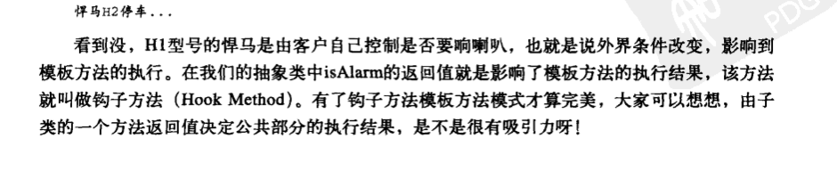

# 一、责任单一原则

```
接口一定要做到单一职责，类的设计尽量做到只有一个原因引起变化
```


# 二、里氏替换原则

```java
public class Father {
    public Collection doSomething(Map map) {
        System.out.println("父类被执行......");
        return map.values();
    }

    public static void main(String[] args) {
        Map<Object, Object> map = new HashMap<>();
        Son son = new Son();
        son.doSomething(map);
    }
}

class Son extends Father {
    public Collection doSomething(HashMap map) {
        System.out.println("子类被执行......");
        return map.values();
    }
}

会执行 父类，因为这个不是重写，形参格式不一样。所以是哪个格式的就执行哪个格式的 如果都是其实参的父类，就就近原则 那个近 就运行哪个方法
```

```
覆写或实现父类的方法时输出结果可以被缩小
```

## 最佳实践

```
在项目中，采用里氏替换原则时，尽量避免子类的"个性"，一旦子类有"个性"，这个子类和父类之间的关系就很难调和了，吧子类当做父类使用，子类的"个性"被抹杀 -- 委屈了点;吧子类单独作为一个业务来使用，则会让代码间的耦合关系变得扑朔迷离 -- 缺乏类替换的标准
```

# 三、依赖倒置原则

## 依赖的三种写法

```java
1、构造函数传递依赖对象
在类中通过构造函数声明依赖对象
class Driver {
	private Car car;
	public Driver(Car car) {
		this.car = car;
	}
    public void drive() {
    	this.car.run();
    }
}
```

```
2、Setter 方法传递依赖对象
3、接口声明依赖对象
```

## 最佳实践

```
1、每个类尽量都有接口或抽象类，或者抽象类和接口两者都具备
2、变量的表面类型尽量是接口或者是抽象类
	(例外：如果你要使用类的 clone() 方法，就必须使用实现类)
3、任何类都不应该从具体类派生
4、尽量不要覆写基类的方法
	如果基类是一个抽象方法，而且这个方法已经实现了，子类尽量不要覆写。类间依赖
5、结合里氏替换原则使用，父类出现的地方子类就能出现。我们根据前面的讲解，可得出这样一个通俗的规则：
	接口负责定义 public 属性和方法，并且声明与其他对象的依赖关系，抽象类负责公共构造部分的实现，实现类准确的实现业务逻辑，同时在适当的时候对父类进行细化。
	
	面向接口编程是依赖倒置原则的核心
```


# 四、接口隔离原则

```
接口有两种一种是 实例接口。一种是类接口。
实例接口
	就是普通的实例类

类接口
	就是 interface 接口
```


```
1、客户端不应该依赖它不需要的接口
2、类间的依赖关系应该建立在最小接口上

总结起来就是：
	建立单一接口，不要建立臃肿庞大的接口。再通俗一点讲:接口尽量细化， 同时接口的方法尽量少。提供给每个模块的都应该是单一接口，提供给几个模块就应该有几个接口，而不是建立一个庞大臃肿的接口，容纳所有的客户端访问。
```

## 最佳实践

```
1、一个接口只服务于一个子模块或业务逻辑
```

# 五、迪米特法则

```
也叫最少知道原则

1、一个方法中尽量不要引入一个类中不存在的对象。
	就是出现在 成员变量，方法的输入输出参数中，而不要突然出现在方法内部
2、如果一个方法放在本类中，既不增加类间关系，也对本类不产生负面影响，就放置在本类中
```

# 六、开闭原则

```
1、对扩展开放，对修改关闭
```

```
我们吧价格定义为 int 类型并不是错误，在非金融类项目中对货币处理时，一般取2位精度，通常的设计方法是在运算中扩大100倍，在需要展示时再缩小100倍，减少精度带来的误差。
```

如何使用开闭原则

```
1、抽象约束
第一、通过接口或抽象类约束扩展，对扩展进行边界限定，不允许出现在接口或抽象类中不存在的 public 方法;

第二、参数类型、引用对象尽量使用接口或者抽象类，而不是实现类

第三、抽象层尽量保持稳定，一旦确定即不允许修改。
```

自我理解

```
对于新加入的功能，不应该修改原有的 接口，而是应该添加新的接口，和新的实现类
```


# 七、单例模式

# 八、工厂方法模式

```
其定义为:
	定义一个用于创建对象的接口，让子类决定实例化哪一个类。工厂方法使一个类的实例化延迟到其子类。
```


# 九、抽象工厂模式

```
什么情况下使用抽象工厂模式呢
比如一个应用，需要在三个不同平台(windows、Linux、Android)上运行，你会怎么设计？分别设计三套不同的应用？非也，通过抽象工厂模式屏蔽操作系统对应用的影响。
```

# 十、模板方法模式

```
定义：
	一个操作中的算法的框架，而将一些步骤延迟到子类中。使得子类可以不改变一个算法的结构既可重定义该算法的某些特定步骤
	就是在父类里面调用本身的抽象方法，而抽象方法在子类实现。
```

```
应用和优点
1、封装不变部分，扩展可变部分
2、提取公共部分代码，便于维护
3、行为由父类控制，子类实现
```

```
使用场景
1、多个子类有公有的方法，并且逻辑基本相同时。
2、重要、复杂的算法，可以吧核心算法设计为模板方法，周边的相关细节功能则由各个子类实现
3、重构时，模板方法是一个经常使用的模式，吧相同的代码抽取到父类中，然后通过钩子函数约束其行为。
```





# 十一、建造者模式

```
将一个复杂对象的构建与它的表示分离，使得同样的构建过程可以创建不同的表示。
```

优点

```
1、封装性
	使用建造者模式可以使客户端不必知道产品内部组成的细节。
2、建造者独立，容易扩展
3、便于控制细节风险
	由于具体的建造者是独立的，因此可以对建造过程逐步细化，而不对其他的模块产生任何影响。
```

建造者模式的使用场景

```
1、相同的方法，不同的执行顺序，产生不同的事件结果时，可以采用建造者模式
2、多个部件或零件，都可以装配到一个对象中，但是产生的运行结果有不相同时，可以采用该模式。
3、产品类非常复杂，或者产品类中的调用顺序不同产生了不同的效能，这个时候使用建造者模式非常适合。
4、本质应该就是将创建对象多变的时候，可以将其封装起来
建造者模式关注的是零件类型和装配工艺(顺序)。
```

```
1、因为执行顺序不同，所以需要自己规定顺序
2、规定好顺序开始 new 对象了，但是因为每次都要规定麻烦
3、使用几个常用的顺序，规定好，使用那个类进行创建
```

建造者模式的核心

```
就是零件，建造者怎么去建造一个对象？是零件的组装，组装的顺序不同对象效能也不同，这才是建造者模式要表达的核心意义。
```

建造者模式和工厂模式的区别

```
建造这模式最主要的功能是基本方法的调用顺序安排，也就是说，零件的装配，顺序不同产生的对象也不同

而工厂方法的重点是创建。
```

# 十二、代理模式

```

```


